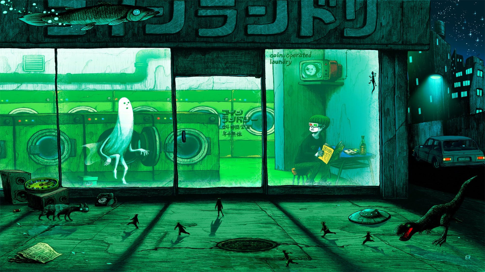

> Welcome, code boy who loves coding and is curious about new technologies 💻

欢迎你，热爱编码且对新技术充满好奇心的码仔 💻

> This site mainly provides front-end knowledge output, front-end interview questions, business thinking and technical knowledge in the Web3 field. I usually record some thoughts that are not limited to technology, I hope it can help you!

本站点主要提供前端知识输出、前端面试题、业务场景以及 Web3 领域的技术知识。平时也会记录一些不局限于前端技术的思考，本质上脱离不开技术的范畴，希望能帮到你！

> If you are interested in more handwritten question source code, you can go to [Github Code Library](https://github.com/Code-Shrimpsss/Front-Dowork-Code), if it is helpful to you, don't be stingy with your Star ⭐ oh~

如果对更多手写题源码感兴趣的话，可以前往 [Github 代码库](https://github.com/Code-Shrimpsss/Front-Dowork-Code)， 如果对你有帮助的话，不要吝啬你的 Star⭐ 哦~

<!-- :::tip
我会坚持原创和分享优质技术文章的方向，持续输出高质量的内容，在学习和总结的过程中不断提高自己，同时也希望能和大家一起成长与进步。
::: -->

<!-- Use the power of React to create interactive blog posts.

```js
<button onClick={() => alert('button clicked!')}>Click me!</button>
```

<button onClick={() => alert('button clicked!')}>Click me!</button> -->


